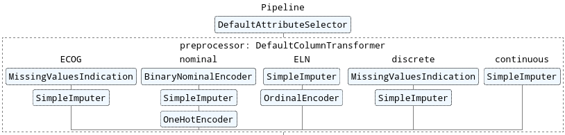

# Excerpt of implementation

*Prediction of Complete Remission and Survival in Acute Myeloid Leukemia Using Supervised Machine Learning*

<!-- vscode-markdown-toc -->
* 1. [Data](#Data)
	* 1.1. [Cleaning](#Cleaning)
		* 1.1.1. [Handling of missing values](#Handlingofmissingvalues)
		* 1.1.2. [Coding of categorical attributes](#Codingofcategoricalattributes)
	* 1.2. [Feature Selection](#FeatureSelection)
		* 1.2.1. [Static selection](#Staticselection)
		* 1.2.2. [Dynamic selection](#Dynamicselection)
	* 1.3. [Feature Scaling](#FeatureScaling)
* 2. [Models](#Models)
	* 2.1. [Configuration](#Configuration)
		* 2.1.1. [Feature generation](#Featuregeneration)
		* 2.1.2. [Supervised Learning](#SupervisedLearning)
		* 2.1.3. [Grid-Search](#Grid-Search)
* 3. [Training](#Training)

<!-- vscode-markdown-toc-config
	numbering=true
	autoSave=true
	/vscode-markdown-toc-config -->
<!-- /vscode-markdown-toc -->

##  1. <a name='Data'></a>Data

The following configurable sub-pipeline generates feature records and variants from the given pre-processed SAL dataset.



###  1.1. <a name='Cleaning'></a>Cleaning

Data cleaning involves the imputation of missing values and the encoding of existing values. Different data types from the attribute analysis are treated as equally as possible to minimize distortions. The implementation is in the class [`DefaultColumnTransformer`](code/default-column-transformer.py).

####  1.1.1. <a name='Handlingofmissingvalues'></a>Handling of missing values

The SAL dataset is incomplete. Not all machine learning methods are able to handle this. Since many ML methods are to be compared, these missing values are generally imputed. Since imputation can lead to a distortion of the problem, imputed values for the attribute ECOG as well as for all discrete attributes are marked with an additional binary attribute (cf. [`MissingValuesIndication`](code/missing-values-indication.py)).

The following imputation of ordinal, discrete and continuous attributes is done with the median of all values of the respective attribute.

All variants of the ELN score (*ELNRisk*, *CGELN* and *CGSTUD*), as well as nominal attributes are imputed with a constant value (missing/unknown/etc.).

####  1.1.2. <a name='Codingofcategoricalattributes'></a>Coding of categorical attributes

All nominal attributes, binary attributes, and mutation indicators are transformed by sal.data.encode.BinaryNominalEncoder, where 1 and 0 are replaced by Y and N, and missing, and non-binary values are ignored (cf. sal.data.encode.BinaryNominalEncoder).

The variants of the ELN score are encoded ordinally and all nominal attributes are encoded one-hot.

###  1.2. <a name='FeatureSelection'></a>Feature Selection

The number of origin attributes in the SAL dataset is high (up to 138) and can be reduced considerably. Such a reduction should be made to avoid the "curse of dimensionality".

One effect includes overfitting with supervised ML, where the model performs well with training data but generalizes poorly with new data. The model then detects patterns in the noise/randomness itself.

Furthermore, clustering is made more difficult with Unsupervsied ML. Too many dimensions cause statistical methods, on which Unsupervised ML is essentially based, to fail, so that elements in the data set appear equally distant from all others. As a result, similarity measures, such as Euclidean distance, yield useless results and clustering quality declines.

Thus, choosing an appropriate subset of features is important not only for speeding up the training of the models, but also for the interpretability of the results.

Feature selection is used in two different places:

####  1.2.1. <a name='Staticselection'></a>Static selection

Before the original data is converted, attributes defined as irrelevant, constant attributes (units and the like) and those with low information content are to be filtered out. The implementation is performed by sal.features.selection.DefaultAttributeSelector and is located in sal.features.selection.drop_irrelevant_attributes(), sal.features.selection.drop_constant_attributes() and sal.features.selection.drop_features_with_low_information_gain().

####  1.2.2. <a name='Dynamicselection'></a>Dynamic selection

Once the dataset has been generated by the pipeline, the remaining features are subjected to tests for fitness with respect to a specific target. For example, the correlation between a learning goal such as CR1 and each feature can be calculated. The following methods are used for this purpose:

- Correlation
- ꭓ²-Test
- Recursive Feature Elimination
- Lasso regularization
- Random Forest Ranking

A table is then calculated with the feature support as the product of method and feature. The threshold for the feature support is set in the configuration and decides which features are included in the training. See [`feature-selection.py`](code/feature-selection.py).

###  1.3. <a name='FeatureScaling'></a>Feature Scaling

One of the most important transformations applied to the feature dataset is scaling. Few machine learning algorithms work well when the numberic attributes have very different scales (cf. HB and LDH). The two most common methods to homogenize the scales of all attributes are normalization (min-max scaling) and standardization (Z-score).

From the visualizations of the attribute analysis, we suspected outliers for some attributes:

- PLT
- LDH
- HB
- FIB

Since standardization is less prone to outliers, it is preferred over normalization and applied to all attributes.

The attributes D16BMB and EFSTM can also be partially freed from outliers using a logarithmic transformation. A power transformation can be applied to RFSTM, OSTM, WBC and FLT3R.

##  2. <a name='Models'></a>Models

###  2.1. <a name='Configuration'></a>Configuration

Die Konfiguration des Prototypen wird im YAML-Format 6 vorgenommen. Dabei werden drei verschiedene Strukturen unterschieden:

####  2.1.1. <a name='Featuregeneration'></a>Feature generation

For the configurations of the generation (encoding, imputation) of features from the preprocessed data set, the file *config/build_features.yml* is used. It essentially describes the parameters for the sub-pipeline in [`DefaultColumnTransformer`](code/default-column-transformer.py).

```yaml
default:
  preprocessor:
    ECOG:
      missing_indicator:
        suffix: unknown
      imputer:
        strategy: median

mean_imputation:
  preprocessor:
    ECOG:
      imputer:
        strategy: mean
```

Line 1 of the configuration describes the name of a configuration, here "default". A variant of this can be found in line 9 ("mean_imputation"). A separate feature record is created for each configuration. In the code examples the configuration of the ECOG attribute is shown. In this way, different preprocessing strategies can be specified for different attributes.

The names and value ranges of the parameters, such as suffix or strategy can be found in the implementation section and in the sklearn Python library. The following classes are used in the pipeline of the DefaultColumnTransformer:

- [`MissingValuesIndication`](code/missing-values-indication.py)
- BinaryNominalEncoder
- SimpleImputer
- OneHotEncoder
- OrdinalEncoder

####  2.1.2. <a name='SupervisedLearning'></a>Supervised Learning

The configurations of the Supervised Learning models are differentiated according to classification and regression problems. For each of the learning objectives there is a separate file. The documentation of excerpted parameters is located as a comment in the files itself. The following configuration sets up the training for an individual classifier. See [*train-cr1.yaml*](code/train-cr1.yml) for a complete example. 

```yaml
classifiers:
    naive_Bayes:
        type: GaussianNB
    logistische_Regression:
        type: LogisticRegression
        params:
        max_iter: 1000
```
####  2.1.3. <a name='Grid-Search'></a>Grid-Search

The Grid Search is configured analogously to the definition of the Supervised ML via the configuration file [*grid-search.yml*](code/grid-search.yml).

##  3. <a name='Training'></a>Training 

For training and evaluation of the models, a feature record, as well as a configuration file (e.g., [*train-cr1.yml*](code/train-cr1.yml)).

After running, under *reports* a folder for each destination variable (see configuration: `label_column_name: CR1_Y`) generates. Within this, folders are created for each experimental variant, in which finally files are the following meaning.


| File | Description |
| --- | --- |
| vergleich.csv | tabular comparison of Performance |
| vergleich.png | graphic comparison of Performance |
| feature_support.csv | tabular comparison of Feature-Selektion |
| naive_Bayes.png | Graphic Report for Naive Bayes Performance |
| …   | …   |

An excerpt of the implementation can be found in [*train-classifiers.py*](code/train-classifiers.py).
